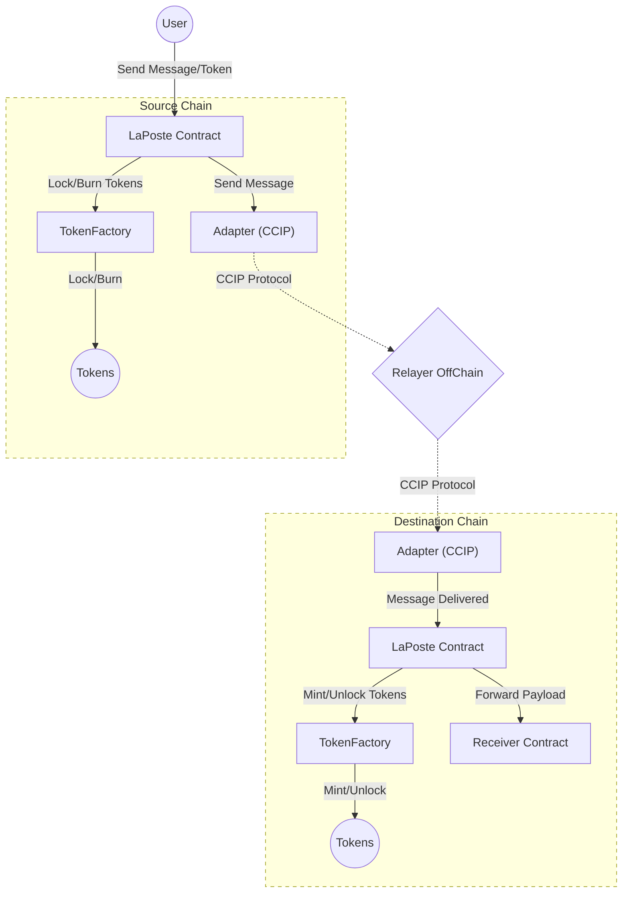

# LaPoste



## Étapes

- Clonage du repo ✅
- Compréhension du besoin à l’aide du README ✅
- Lecture du script de déploiement pour connaître rapidement quel contrat dépend de qui (pas de script ici) ❌
- Génération d’un diagramme de classes pour connaître les interdépendances ✅
- Rédaction d’un flowchart pour avoir une bonne vue d’ensemble ✅
- Lecture en détail du code pour comprendre certains aspects techniques ✅
- Recherche des pistes d’amélioration :
  - Couverture des tests ✅
  - Stockage du smart contract ✅
  - Analyse statique ✅

## Analyse

### LaPoste Contract

- **Rôl**e : Contrat principal permettant l’envoi de messages inter-chaînes et de tokens.
- **Fonctionnement** :
 • Envoi de messages : La fonction sendMessage encode le message (payload + informations sur les tokens à transférer), incrémente un nonce (spécifique à la chaîne de destination), et effectue un delegatecall vers l’Adapter pour initier la transmission cross-chain via CCIP. Cette fonction appel également le TokenFactory contract afin de burn/lock des tokens (elle a pour pré-requis un approve sur le TokenFactory contract)
 • Réception de messages : La fonction receiveMessage est appelée uniquement par l’Adapter. Elle vérifie le nonce (prévention contre les replay attaques) et exécute la logique de réception (mint ou unlock des tokens, puis appel au destinataire).
 • Gestion des tokens : Lors d’un envoi, si un token est transféré, LaPoste fait appel à TokenFactory pour effectuer un burn (token wrap sur la chaîne source) ou un lock (token natif sur la chaîne source). Lors de la réception, il fait appel à TokenFactory pour mint (tokens wrap) ou unlock (tokens natifs).
 • **Propriétés intéressantes** :
      • Use de Ownable2Step pour sécuriser le changement d’ownership.
      • Usage de receivedNonces[originChainId][nonce] pour empêcher la relecture d’un message déjà traité. Les nonces des messages recu ne suivent pas une suite continue d'entier numérique (on aurait pu penser de stoker uniquement le dernier)
      • Événements `MessageSent` et `MessageReceived` permettant de tracer l’état cross-chain.

### TokenFactory Contract

- **Rôle** : Gérer la logique de lock/unlock (tokens natifs) ou burn/mint (tokens wraps) en fonction de la chaîne.
- **Fonctionnement** :
 • Sur la chaîne principale (CHAIN_ID), les tokens natifs sont simplement transférés (lock/unlock). Le contract agit donc comme un escrow token.
 • Sur les autres chaînes, on créer des tokens wrap à la demande.
 • La fonction `getOrCreateWrappedToken` déploie un nouveau contrat Token si le wrappedToken associé au token non natif n’existe pas encore.
 • La fonction `mint` fait un `safeTransfer` sur la chaîne de destination ou un mint d'un wrappedToken si on est sur une chaîne secondaire.
 • La fonction burn fait l’opération inverse (déverrouillage ou burn de wraps).
 • Les mappings wrappedTokens[nativeToken] et nativeTokens[wrappedToken] permettent d’assurer la correspondance.
 • **Propriétés intéressantes** :
     • Le déploiement du wrapped token se fait avec un salt (calculé via abi.encodePacked) pour assurer l’unicité de l’adresse.
     • L’ownership du contrat TokenFactory est finalement renoncé (la fonction setMinter renonce à l’ownership après définition du minter).

### Adapter Contract

- **Rôle** : Interagir avec le router CCIP (Chainlink) pour l’envoi et la réception de messages cross-chain.
- **Fonctionnement** :
 • Envoi de message : Reçoit un appel (via delegatecall) depuis LaPoste, encode le payload CCIP (avec gasLimit total = executionGasLimit + BASE_GAS_LIMIT), et exécute un ccipSend vers router.
 • Réception de message : Est appelé par le router via la fonction ccipReceive. Vérifie que l’expéditeur décodé (message.sender) est bien l’adresse de LaPoste, et transmet le payload à LaPoste.
 • **Points clés** :
     • L’envoi cross-chain utilise un paramètre msg.value pour payer les frais CCIP.
     • Le contrat vérifie router.isChainSupported(chainSelector) avant d’envoyer.
     • Les messages entrants doivent provenir exclusivement du router (modifier onlyRouter).

## Architecture

```bash
sol2uml class ./src -f png -o ./classDiagram.png --hideInterfaces
```


## Pistes d’Amélioration

1. **Imports plus spécifiques**  
   - Éviter les imports globaux pour réduire la taille du bytecode, faciliter l’audit et limiter les conflits.
   - **Exemple** : Au lieu de `import "@openzeppelin/contracts/token/ERC20/utils/SafeERC20.sol";`, importer uniquement le module nécessaire si le reste du code n’est pas utilisé.

2. **Convention de nommage pour les fonctions internes**  
   - Préfixer les fonctions internes par `_` pour renforcer la lisibilité et indiquer clairement la visibilité.
   - **Exemple** : `function _executeTransfer(...) internal { ... }`

3. **Factory dédiée pour le déploiement de contrats**  
   - Une “Factory” facilite la gouvernance, la traçabilité et assure l’unicité des adresses lors du déploiement.
   - **Ressource** : [createx](https://github.com/pcaversaccio/createx) pour un déploiement avec `CREATE2`.

4. **Admin Proxy et Gestion centralisée de l’Ownership**  
   - Utiliser un “Admin Proxy” (ou multisig) pour gérer les rôles (owner, minter, etc.) sur plusieurs chaînes.
   - **Avantage** : Administration uniformisée, upgrades coordonnées et réduction du risque d’erreurs.

5. **Utiliser `transferOwnership` au lieu de `_transferOwnership`**  
   - `TokenFactory` (L.47)
   - `transferOwnership` vérifie que l’adresse n’est pas `0`, réduisant le risque de “soft lock” si une adresse invalide est fournie.

6. **Réflexion sur le rôle de “minter” et l’ownership**  
   - Passer directement le `minter` ou l’owner dans le constructeur si possible.
   - Vérifier la nécessité de renoncer à l’ownership si le contrat doit évoluer à l’avenir.

7. **Événements et messages d’erreur plus riches**  
   - Inclure plus de contexte (ex. `chainId` dans `CannotSendToSelf()`) pour faciliter débogage et monitoring.

8. **Rendre l’adresse `router` (CCIP) modifiable**  
   - L’actuel `immutable` rend tout changement du `router` compliqué.
   - **Solution** : rendre le contrat upgradeable (UUPS/TransparentProxy) ou ajouter une fonction de mise à jour de l’adresse du `router`.

9. **Mise en place de CI/CD**  
    - build, tests, coverage, linter, format, analyse statique

#### Coverage


On peut constater que certaines fonctions ne sont pas testée. On pourrait donc augmenter le coverage en ajoutant de nouveaux tests. Cela permettrait en cas d'upgrade d'évité d'introduire des regression.

#### Storage

```bash
sol2uml storage src,node_modules/@openzeppelin -c ContractName -f png
```


Pas d'amélioration notable en ce qui concerne l'optimisation du storage.

#### Analyse Statique (Slither)

```bash
slither . 
```

Le rapport Slither ci-dessous signale plusieurs alertes qui, après examen, se révèlent être des faux positifs. Le tableau récapitule chaque alerte ainsi que l’explication.

## Analyse Statique (Slither)

Le rapport Slither ci-dessous signale plusieurs alertes qui, après examen, se révèlent être des faux positifs dans notre contexte métier. Le tableau récapitule chaque alerte ainsi que l’explication.

| **Issue**                          | **Détails**                                                                                                                                  | **Location**                                                               | **Reference**                                                                                                                                 | **Faux Positif 🟢** |
| ---------------------------------- | -------------------------------------------------------------------------------------------------------------------------------------------- | -------------------------------------------------------------------------- | --------------------------------------------------------------------------------------------------------------------------------------------- | ------------------ |
| Arbitrary 'from' in `transferFrom` | Slither alerte sur le fait que `burn()` appelle `safeTransferFrom(from, address(this), amount)` avec un `from` arbitraire.                   | `TokenFactory.sol#79-89`                                                   | [Slither Doc: Arbitrary 'from' in transferFrom](https://github.com/crytic/slither/wiki/Detector-Documentation#arbitrary-from-in-transferfrom) | Faux positif       |
| Controlled `delegatecall`          | Dans `LaPoste.sendMessage`, l’appel à `adapter.delegatecall(...)` est contrôlé par un input externe.                                         | `LaPoste.sol#80-159`                                                       | [Slither Doc: Controlled delegatecall](https://github.com/crytic/slither/wiki/Detector-Documentation#controlled-delegatecall)                 | Faux positif       |
| `abi.encodePacked` collision       | Slither souligne un risque de collision lors de l’usage de `abi.encodePacked` avec plusieurs arguments dynamiques (noms, symboles, etc.).    | `TokenFactory.sol#97-112`                                                  | [Slither Doc: abi.encodePacked collision](https://github.com/crytic/slither/wiki/Detector-Documentation#abi-encodepacked-collision)           | Faux positif       |
| Reentrancy vulnerability           | Slither détecte des appels externes avant la mise à jour de certaines variables d’état (Ex. `receiveMessage` et `sendMessage` dans LaPoste). | `LaPoste.sol#164-221 (receiveMessage)<br>LaPoste.sol#80-159 (sendMessage)` | [Slither Doc: Reentrancy vulnerabilities](https://github.com/crytic/slither/wiki/Detector-Documentation#reentrancy-vulnerabilities-1)         | Faux positif       |
| Uninitialized local variable       | Slither considère que la variable `message` dans `LaPoste.sendMessage` n’est pas initialisée.                                                | `LaPoste.sol#90`                                                           | [Slither Doc: Uninitialized local variables](https://github.com/crytic/slither/wiki/Detector-Documentation#uninitialized-local-variables)     | Faux positif       |
