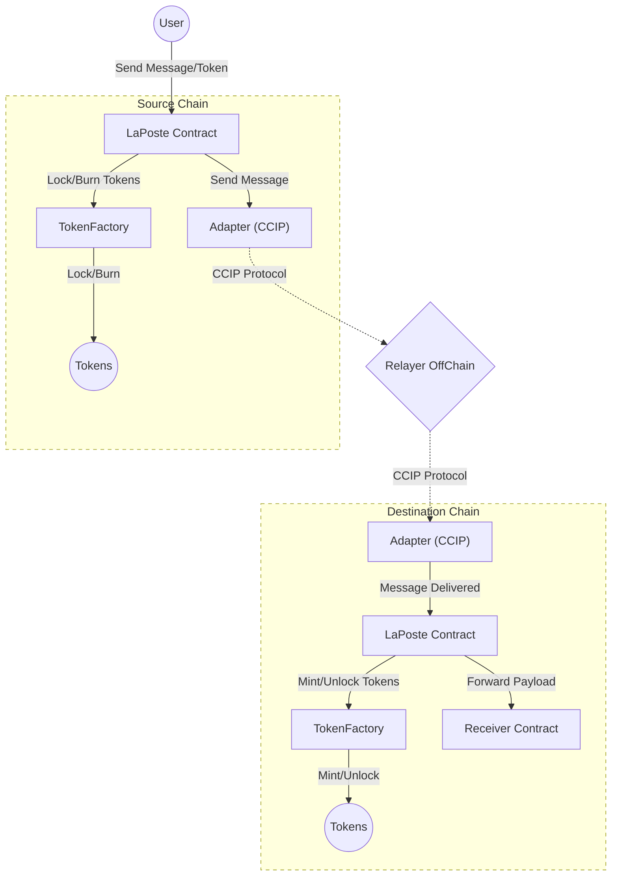

# LaPoste



## Étapes

- Clonage du repo ✅
- Compréhension du besoin à l’aide du README ✅
- Lecture du script de déploiement pour connaître rapidement quel contrat dépend de qui (pas de script ici) ❌
- Génération d’un diagramme de classes pour connaître les interdépendances ✅
- Rédaction d’un flowchart pour avoir une bonne vue d’ensemble ✅
- Lecture en détail du code pour comprendre certains aspects techniques ✅
- Recherche des pistes d’amélioration :
  - Couverture des tests ✅
  - Stockage du smart contract ✅
  - Analyse statique ✅

## Analyse

### LaPoste Contract

Ce contract a pour but de permettre a des utilisateur d'envoyer des messages interchain ainsi que des token. Il s'appuie sur le protocole CCIP de chainLink

- Si des tokens sont envoyés, bien penser à faire l'approve côté front du Smart Contract Token Factory.
- Utilisation de `Ownable2Step` pour éviter les erreurs de transfert d'ownership vers des smart contracts ou EOA non désirés.
- Utilisation d'un nonce pour éviter les Replay Attacks onChain.
- Utilisation d'un double mapping au lieu d'un simple pour les `receivedNonces`. En effet, certains messages envoyés ne peuvent pas tous être reçus. Les nonces reçus ne constituent donc pas une suite d'entiers positifs continue.

### TokenFactory Contract

TokenFactory a pour but de manager les otken Natif ou non sur la chain en question :

- Pour les tokens natifs, on les lock/unlock, tandis que pour les tokens non-natifs, on les burn/mint.
- Si un WrappedToken n'existe pas encore sur la chaîne, alors un nouveau Smart Contract `Token` est déployé et son adresse est stockée.
- Le contrat agit également comme un registry.

### Adapter Contract

Permet d'interagir avec router CCIP de chainlink et donc par extension avec le protocol CCIP :

- Sert d'interface de communication pour le protocole d'interopérabilité inter-chaînes de ChainLink (CCIP)
- Écoute ou envoie des messages au routeur ChainLink

## Architecture

```bash
sol2uml class ./src -f png -o ./classDiagram.png --hideInterfaces
```


### Pistes d'amélioration

- Utiliser des imports spécific au lieu d'un import global.
- Utiliser des noms de fonction commençant par '_' pour les fonctions interne afin de respecter la convention proposée par Solidity.
- Utilisation d'une factory afin de garantir l'unicité de l'address du smart contract déploye (risqué avec un EOA). Factry possible => <https://github.com/pcaversaccio/createx>

#### Questions/improve

- Qu'est ce qui se passe si ce ne son pas des Wallet mais des SCA (Smart Contract Account) qui effectue les transaction ???
- use multicall to batch sub-transaction together
- On aurait pu stoker stoker les mapping dans une struct
- adapter.delegatecall peut utiliser une lib de OZ ?

#### Questions/improve

- pourquoi ne pas avoir un ownableTwoStep (permet d'eviter des erreurs)
- use transferOwnership instead of _transferOwnership. if wrong address is set it could freeze the contract and will generate any issue as all contract should have the same deployment address
- pourquoi minter est le owner et doit renoncer à l'ownership du contract ?
- pourquoi ne pas directement mettre le minter dans le constructeur
- ajouter certains arg dans l'event Error pour avoir une meilleur exeprience utilisateur/dégeugage

#### Questions/improve

- comment le routeur de chainLink est géré ? Est ce qu'il utilise un proxy ? Qu'est ce qui se passe si jamais l'address du routeur change ?

#### Coverage


#### Storage

```bash
sol2uml storage src,node_modules/@openzeppelin -c ContractName -f png
```


#### Analyser static

```bash
slither . 
```

[
  {
    "issue": "Arbitrary 'from' in transferFrom",
    "details": "TokenFactory.burn(address,address,uint256) uses arbitrary 'from' in transferFrom at IERC20(nativeToken).safeTransferFrom(from,address(this),amount).",
    "location": "src/TokenFactory.sol#79-89",
    "reference": "https://github.com/crytic/slither/wiki/Detector-Documentation#arbitrary-from-in-transferfrom"
  },
  {
    "issue": "Controlled delegatecall",
    "details": "LaPoste.sendMessage(ILaPoste.MessageParams,uint256,address) uses delegatecall to an input-controlled function ID.",
    "location": "src/LaPoste.sol#80-159",
    "reference": "https://github.com/crytic/slither/wiki/Detector-Documentation#controlled-delegatecall"
  },
  {
    "issue": "abi.encodePacked collision",
    "details": "TokenFactory.getOrCreateWrappedToken(address,string,string,uint8) calls abi.encodePacked() with multiple dynamic arguments.",
    "location": "src/TokenFactory.sol#97-112",
    "reference": "https://github.com/crytic/slither/wiki/Detector-Documentation#abi-encodePacked-collision"
  },
  {
    "issue": "Reentrancy vulnerability",
    "details": [
      "In LaPoste.receiveMessage(uint256,bytes), external calls are made before modifying state variables. Cross-function reentrancy possible.",
      "In LaPoste.sendMessage(ILaPoste.MessageParams,uint256,address), external calls are made before modifying state variables. Cross-function reentrancy possible."
    ],
    "locations": [
      "src/LaPoste.sol#164-221 (receiveMessage)",
      "src/LaPoste.sol#80-159 (sendMessage)"
    ],
    "reference": "https://github.com/crytic/slither/wiki/Detector-Documentation#reentrancy-vulnerabilities-1"
  },
  {
    "issue": "Uninitialized local variable",
    "details": "LaPoste.sendMessage(ILaPoste.MessageParams,uint256,address).message is a local variable never initialized.",
    "location": "src/LaPoste.sol#90",
    "reference": "https://github.com/crytic/slither/wiki/Detector-Documentation#uninitialized-local-variables"
  }
]
