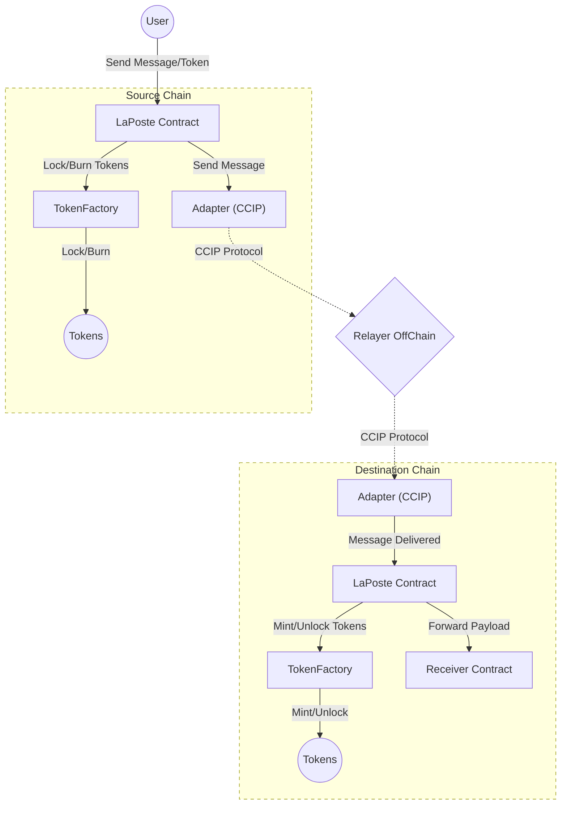
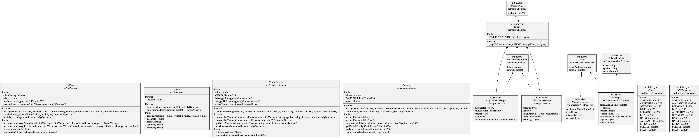
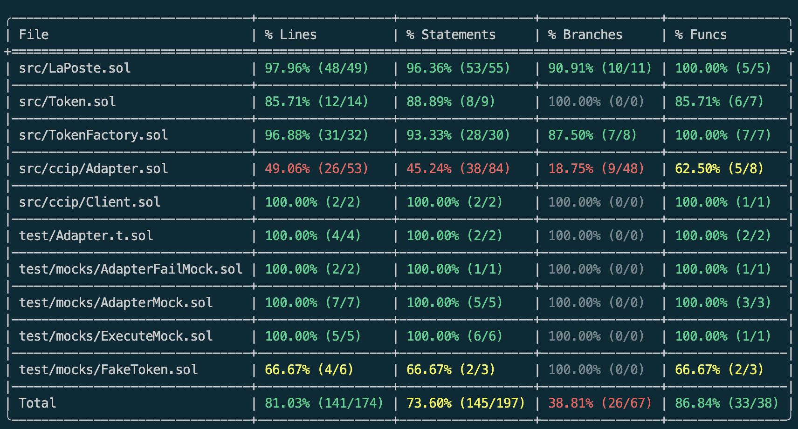
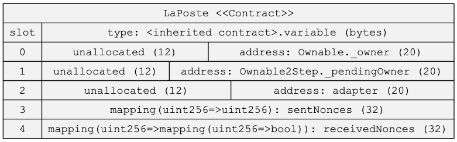
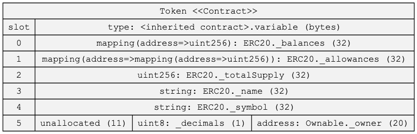
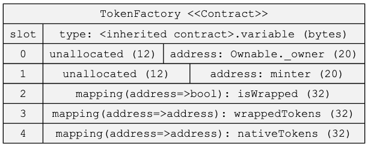

# LaPoste



## Étapes

- Clonage du repo ✅
- Compréhension du besoin à l’aide du README ✅
- Lecture du script de déploiement pour connaître rapidement quel contrat dépend de qui (pas de script ici) ❌
- Génération d’un diagramme de classes pour connaître les interdépendances ✅
- Rédaction d’un flowchart pour avoir une bonne vue d’ensemble ✅
- Lecture en détail du code pour comprendre certains aspects techniques ✅
- Recherche des pistes d’amélioration :
  - Couverture des tests ✅
  - Stockage du smart contract ✅
  - Analyse statique ✅

## Analyse

### LaPoste Contract

- **Rôl**e : Contrat principal permettant l’envoi de messages inter-chaînes et de tokens.
- **Fonctionnement** :
 • Envoi de messages : La fonction sendMessage encode le message (payload + informations sur les tokens à transférer), incrémente un nonce (spécifique à la chaîne de destination), et effectue un delegatecall vers l’Adapter pour initier la transmission cross-chain via CCIP. Cette fonction appel également le TokenFactory contract afin de burn/lock des tokens (elle a pour pré-requis un approve sur le TokenFactory contract)
 • Réception de messages : La fonction receiveMessage est appelée uniquement par l’Adapter. Elle vérifie le nonce (prévention contre les replay attaques) et exécute la logique de réception (mint ou unlock des tokens, puis appel au destinataire).
 • Gestion des tokens : Lors d’un envoi, si un token est transféré, LaPoste fait appel à TokenFactory pour effectuer un burn (token wrap sur la chaîne source) ou un lock (token natif sur la chaîne source). Lors de la réception, il fait appel à TokenFactory pour mint (tokens wrap) ou unlock (tokens natifs).
 • **Propriétés intéressantes** :
      • Use de Ownable2Step pour sécuriser le changement d’ownership.
      • Usage de receivedNonces[originChainId][nonce] pour empêcher la relecture d’un message déjà traité. Les nonces des messages recu ne suivent pas une suite continue d'entier numérique (on aurait pu penser de stoker uniquement le dernier)
      • Événements `MessageSent` et `MessageReceived` permettant de tracer l’état cross-chain.

### TokenFactory Contract

- **Rôle** : Gérer la logique de lock/unlock (tokens natifs) ou burn/mint (tokens wraps) en fonction de la chaîne.
- **Fonctionnement** :
 • Sur la chaîne principale (CHAIN_ID), les tokens natifs sont simplement transférés (lock/unlock). Le contract agit donc comme un escrow token.
 • Sur les autres chaînes, on créer des tokens wrap à la demande.
 • La fonction `getOrCreateWrappedToken` déploie un nouveau contrat Token si le wrappedToken associé au token non natif n’existe pas encore.
 • La fonction `mint` fait un `safeTransfer` sur la chaîne de destination ou un mint d'un wrappedToken si on est sur une chaîne secondaire.
 • La fonction burn fait l’opération inverse (déverrouillage ou burn de wraps).
 • Les mappings wrappedTokens[nativeToken] et nativeTokens[wrappedToken] permettent d’assurer la correspondance.
 • **Propriétés intéressantes** :
     • Le déploiement du wrapped token se fait avec un salt (calculé via abi.encodePacked) pour assurer l’unicité de l’adresse.
     • L’ownership du contrat TokenFactory est finalement renoncé (la fonction setMinter renonce à l’ownership après définition du minter).

### Adapter Contract

- **Rôle** : Interagir avec le router CCIP (Chainlink) pour l’envoi et la réception de messages cross-chain.
- **Fonctionnement** :
 • Envoi de message : Reçoit un appel (via delegatecall) depuis LaPoste, encode le payload CCIP (avec gasLimit total = executionGasLimit + BASE_GAS_LIMIT), et exécute un ccipSend vers router.
 • Réception de message : Est appelé par le router via la fonction ccipReceive. Vérifie que l’expéditeur décodé (message.sender) est bien l’adresse de LaPoste, et transmet le payload à LaPoste.
 • **Points clés** :
     • L’envoi cross-chain utilise un paramètre msg.value pour payer les frais CCIP.
     • Le contrat vérifie router.isChainSupported(chainSelector) avant d’envoyer.
     • Les messages entrants doivent provenir exclusivement du router (modifier onlyRouter).

## Architecture

```bash
sol2uml class ./src -f png -o ./classDiagram.png --hideInterfaces
```



### Pistes d'amélioration

- Utiliser des imports spécific au lieu d'un import global.
- Utiliser des noms de fonction commençant par '_' pour les fonctions interne afin de respecter la convention proposée par Solidity.
- Utilisation d'une factory afin de garantir l'unicité de l'address du smart contract déploye (risqué avec un EOA). Factry possible => <https://github.com/pcaversaccio/createx>

#### Questions/improve

- Qu'est ce qui se passe si ce ne son pas des Wallet mais des SCA (Smart Contract Account) qui effectue les transaction ???
- use multicall to batch sub-transaction together
- On aurait pu stoker stoker les mapping dans une struct
- adapter.delegatecall peut utiliser une lib de OZ ?

#### Questions/improve

- pourquoi ne pas avoir un ownableTwoStep (permet d'eviter des erreurs)
- use transferOwnership instead of _transferOwnership. if wrong address is set it could freeze the contract and will generate any issue as all contract should have the same deployment address
- pourquoi minter est le owner et doit renoncer à l'ownership du contract ?
- pourquoi ne pas directement mettre le minter dans le constructeur
- ajouter certains arg dans l'event Error pour avoir une meilleur exeprience utilisateur/dégeugage

#### Questions/improve

- comment le routeur de chainLink est géré ? Est ce qu'il utilise un proxy ? Qu'est ce qui se passe si jamais l'address du routeur change ?

#### Coverage



#### Storage

```bash
sol2uml storage src,node_modules/@openzeppelin -c ContractName -f png
```







#### Analyser static

```bash
slither . 
```

[
  {
    "issue": "Arbitrary 'from' in transferFrom",
    "details": "TokenFactory.burn(address,address,uint256) uses arbitrary 'from' in transferFrom at IERC20(nativeToken).safeTransferFrom(from,address(this),amount).",
    "location": "src/TokenFactory.sol#79-89",
    "reference": "https://github.com/crytic/slither/wiki/Detector-Documentation#arbitrary-from-in-transferfrom"
  },
  {
    "issue": "Controlled delegatecall",
    "details": "LaPoste.sendMessage(ILaPoste.MessageParams,uint256,address) uses delegatecall to an input-controlled function ID.",
    "location": "src/LaPoste.sol#80-159",
    "reference": "https://github.com/crytic/slither/wiki/Detector-Documentation#controlled-delegatecall"
  },
  {
    "issue": "abi.encodePacked collision",
    "details": "TokenFactory.getOrCreateWrappedToken(address,string,string,uint8) calls abi.encodePacked() with multiple dynamic arguments.",
    "location": "src/TokenFactory.sol#97-112",
    "reference": "https://github.com/crytic/slither/wiki/Detector-Documentation#abi-encodePacked-collision"
  },
  {
    "issue": "Reentrancy vulnerability",
    "details": [
      "In LaPoste.receiveMessage(uint256,bytes), external calls are made before modifying state variables. Cross-function reentrancy possible.",
      "In LaPoste.sendMessage(ILaPoste.MessageParams,uint256,address), external calls are made before modifying state variables. Cross-function reentrancy possible."
    ],
    "locations": [
      "src/LaPoste.sol#164-221 (receiveMessage)",
      "src/LaPoste.sol#80-159 (sendMessage)"
    ],
    "reference": "https://github.com/crytic/slither/wiki/Detector-Documentation#reentrancy-vulnerabilities-1"
  },
  {
    "issue": "Uninitialized local variable",
    "details": "LaPoste.sendMessage(ILaPoste.MessageParams,uint256,address).message is a local variable never initialized.",
    "location": "src/LaPoste.sol#90",
    "reference": "https://github.com/crytic/slither/wiki/Detector-Documentation#uninitialized-local-variables"
  }
]
