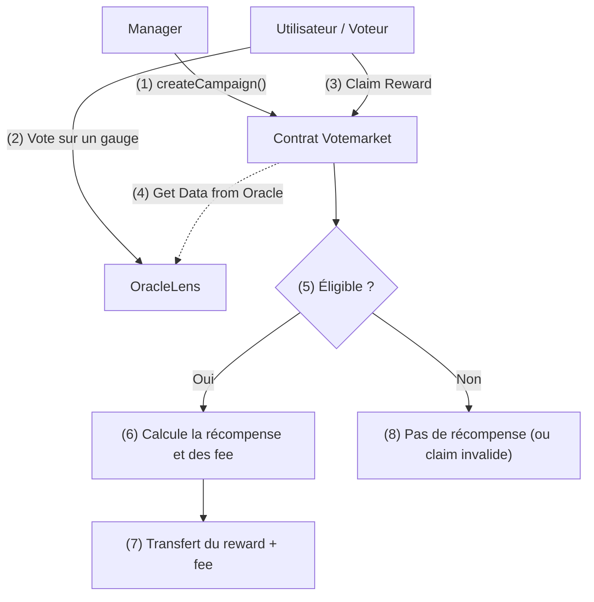

# VoteMarket-V2

## Étapes

- Clonage du repo ✅
- Compréhension du besoin à l’aide du README ✅
- Lecture du script de déploiement pour connaître rapidement quel contrat dépend de qui (pas de script ici) ✅
- Génération d’un diagramme de classes pour connaître les interdépendances ✅
- Rédaction d’un flowchart pour avoir une bonne vue d’ensemble ✅
- Lecture en détail du code pour comprendre certains aspects techniques ✅
- Recherche des pistes d’amélioration :
  - Couverture des tests ✅
  - Stockage du smart contract ✅
  - Analyse statique ✅

## Analyse

L'idée est de distribuer une portion de l'inflation journalière du token pour améliorer l'APR des pools de liquidité en fonction des résultats des votes dans les `gauges`. Cette approche stimule la participation des utilisateurs en offrant des récompenses proportionnelles à leur engagement dans le processus de vote, tout en optimisant les rendements des pools de liquidité. Le poids des votes d'une personne à un instant t (`bias`) dépend de la période pendant laquelle il a bloqué ses tokens de gouvernance ainsi que du nombre de tokens qu'il possède.

### Periphery

### Utils

### VoteMarket

C'est un smart contract directement lié à la veTokenomics. Les utilisateurs verrouillent des tokens de gouvernance en échange de veTokens, leur permettant de voter dans des gauges en échange d'incentives économiques (récompenses). Ces tokens de récompense proviennent probablement des émissions de tokens du protocole et/ou des frais de transaction des utilisateurs sur le protocole.

#### Qu'est-ce qu'une campagne ?

Chaque campagne a un nombre de périodes (epochs) pendant lesquelles les récompenses sont distribuées.

- **Répartition des récompenses** : Calculée en fonction du nombre de votes de chaque utilisateur, validé par un oracle externe (IOracleLens).
- **Frais** : Un pourcentage (par défaut 4%) peut être prélevé sur chaque récompense, versé à un collecteur de frais (feeCollector).
- **Fenêtre de réclamation et de fermeture** :
  - Les utilisateurs peuvent réclamer leurs récompenses tant que la campagne n’est pas officiellement fermée et pendant une certaine période après la fin de la campagne.
  - La campagne peut ensuite être fermée pour récupérer les éventuels jetons non distribués (leftover).

Ce contrat est conçu pour être utilisé de préférence en L2 où les coûts de lecture/écriture sont moindres, car il manipule beaucoup de données relatives aux votes (proofs, validations, etc.).

#### Spécificité intéressante sur le claim

- **Claim pour quelqu'un d'autre** : Possible à condition que ce ne soit pas un compte protégé.
- **Claim pour soi-même** : Possible pour l'utilisateur.

### Oracles

- on associe à une epoch un block
- on associe à une epoch (si elle est valide) un point autrement une valeur marché à un instant donnée. Seul le dataProvider est autorisé à le faire
- on peut ensuite enregistrer un vote pour une epoch donnée valide, et pour une gauge prévise
- Slope : c’est le taux de variation de la puissance de vote dans le temps.
- Bias : c’est la valeur totale de la puissance de vote à l’instant présent (ou à un instant donné), qui va se réduire progressivement jusqu’à zéro.
- ce contract s'apparente au gauge controller si on reprend le whitepaper de cure DAO sur les gauge
- A la création d'une campagne (`createCampaign`) le contract devient le owner des rewards des tokens associés à la Gauge.

## Architecture

### Pistes d'amélioration

### VoteMarket

- `_getPeriod` useless function. It called only one time

#### Oracles

- Utilisation de `Ownable2Step` pour éviter les erreurs de transfert d'ownership vers des smart contracts ou EOA non désirés. Au lieu d'une gouvernance non désirée
- `validEpoch`modifier ne pas faire de stokage en mémoire. Directement faire une lecture
- `lastUpdate`qui est un élément des structure `Point` &  `VotedSlope`. Il est utilisé pour savoir si le state a été updaté ou pas (peut être pas utile)

#### VoteMarket

#### Coverage

#### Analyser static
