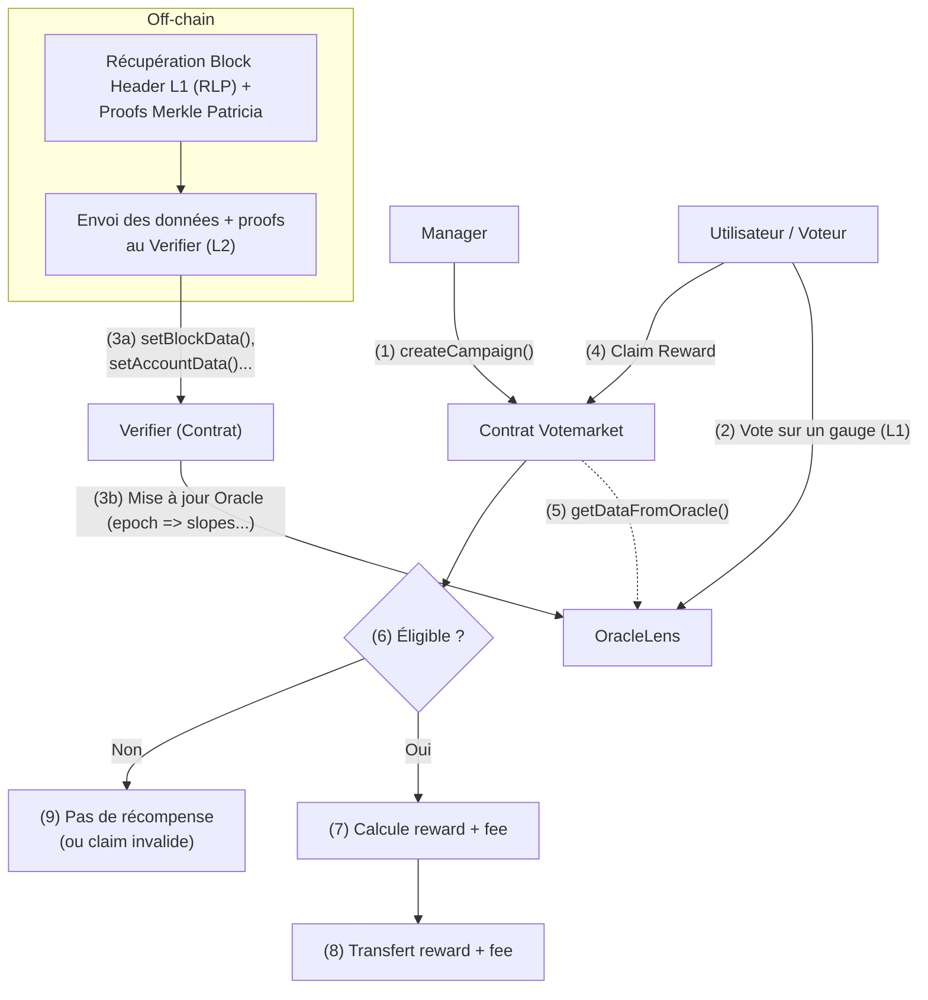
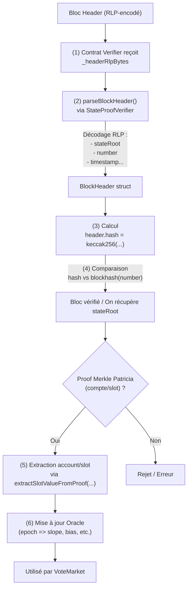

# VoteMarket-V2



## Étapes

- Clonage du repo ✅
- Compréhension du besoin à l’aide du README ✅
- Lecture du script de déploiement pour comprendre les interdépendances entre les contracts ✅
- Génération d’un diagramme de classes pour connaître les interdépendances ✅
- Rédaction d’un flowchart pour avoir une bonne vue d’ensemble ✅
- Lecture en détail du code pour comprendre certains aspects techniques ✅
- Recherche de pistes d’amélioration

## Analyse

L’idée globale est de mettre en place un mécanisme permettant de :

 1. Distribuer une portion de l’inflation journalière d’un token (ou toute autre source de récompense) pour améliorer l’APR des pools de liquidité.
 2. Incentiver les votes dans des gauges, en récompensant proportionnellement la participation au vote.
 3. Coordonner la logique sur plusieurs chaînes (ex. L1 et L2) grâce à un système de cross-chain messaging (via LaPoste, Adapter, TokenFactory).

Les éléments centraux sont donc :

- Des contrats cross-chain (LaPoste, Adapter, TokenFactory) permettant de lock/unlock, ou burn/mint des tokens entre plusieurs chaînes, et d’envoyer des messages (payload) pour synchroniser l’état ou initier des actions.
- Un module VoteMarket permettant de créer et gérer des campagnes (périodes d’incitation) au vote.
- Un Oracle (avec RLP, Merkle Patricia Proof, etc.) pour valider les votes, associant un bloc L1 (ou un epoch) à l’état du protocole.

La finalité : permettre, par exemple, qu’un vote effectué sur L1 déclenche l’attribution de récompenses sur L2, tout en gardant une cohérence temporelle entre les chaînes.

### VoteMarket

Idée : Permettre à des utilisateurs de voter sur des gauges pendant une période donnée (une campagne). Les votes sont validés par un Oracle, puis un système de campagnes distribue des récompenses en fonction des votes.

Qu’est-ce qu’une campagne ?

- Une campagne a un certain nombre de périodes (epochs) pendant lesquelles on distribue des récompenses.
- Les récompenses sont calculées en fonction de la part de vote de l’utilisateur sur le gauge.
- On peut prélever un frais (4 % par défaut) sur chaque claim, distribué au feeCollector.
- Les utilisateurs peuvent réclamer (claim) pendant la campagne et jusqu’à la fin de la fenêtre de claim. Au‐delà, la campagne est fermée et les jetons restants sont envoyés au fee collector.

Spécificité intéressante : Claim

- Un utilisateur peut réclamer pour lui‐même ou pour quelqu’un d’autre, tant que l’autre n’est pas un compte protégé.
- Idéal pour les contrats ou les plateformes tierces qui veulent faciliter la récupération des rewards pour leurs utilisateurs.

Pourquoi plutôt en L2 ?

- Le contrat manipule beaucoup de données (vérif. de votes, proofs, etc.). Les opérations étant coûteuses, déployer les contracts sur des L2 (plus scalable, frais moindres) est souvent plus sensé.
- On peut, via les contrats cross-chain (LaPoste, Adapter, TokenFactory), approvisionner le VoteMarket en récompenses depuis la L1 ou d’autres chaînes.

### Oracle & StateProofVerifier

Rôle principal de l’Oracle

- Associer un epoch (période) à un block (ou un timestamp) spécifique.
- Enregistrer des données de vote (point, slope/bias) pour chaque epoch, fournies par un dataProvider autorisé (prévention des écritures malveillantes).
- Gérer un mapping epoch → blockHeader (un bloc L1 donné est ainsi relié à un epoch sur L2). Cela permet de prouver qu’un vote a été effectué avant/à un certain bloc L1, et donc pendant la bonne période.

Slope & Bias

- slope : taux de décroissance de la puissance de vote dans le temps.
- bias : valeur à un instant t de la puissance de vote.
  
En pratique, on segmente le temps en unités (une semaine) appelées epochs. À chaque epoch, on peut mettre à jour les valeurs (bias, slope) et déterminer la part de vote encore active. Dans le cas d’une veTokenomics, la puissance de vote d’un utilisateur (son bias) diminue au fil des blocs jusqu’à l’expiration de son lock. La slope indique la vitesse de cette décroissance.

#### Zoom sur le StateProofVerifier

Le StateProofVerifier est une librarie solidity qui facilite :

1. Décodage d’un en-tête de bloc (RLP-encoded)
   - RLP (Recursive Length Prefix) est le format de sérialisation d’Ethereum.
   - Avec des fonctions comme parseBlockHeader(...), on extrait :
     - Le stateRoot (la racine Merkle Patricia représentant l’état global du réseau à ce bloc),
     - Le number (numéro du bloc),
     - Le timestamp, etc.

2. Vérification de la validité du bloc
   - Après avoir calculé le hash (`keccak256`) de l’header RLP, on le compare à blockhash(header.number) (uniquement possible pour les 256 derniers blocs).
   - Si la comparaison échoue, la preuve est rejetée. Si elle réussit, on peut se fier au stateRoot pour prouver l’état.

3. Extraction et vérification d’un compte
   - extractAccountFromProof(...) reconstitue (ou prouve l’absence d’) un compte à partir de la trie de l’état.
   - On fournit :
     - Le stateRoot,
     - L’adresse du compte (sous forme keccak256(address)),
     - La Merkle Patricia Proof.
   - Le contrat reconstruit alors :
      - Le nonce,
      - La balance,
      - Le storageRoot,
      - Le codeHash.
   - Si le compte n’existe pas, cela signifie, par exemple, que l’utilisateur ne dispose d’aucun verrouillage (bias/slope) et/ou qu'il n’a pas voté.

4. Extraction et vérification d’une slot de stockage
   - extractSlotValueFromProof(...) reconstitue la valeur stockée dans un slot (variable) d’un contrat.
   - On transmet  la Merkle Patricia Proof et la clé du slot.
   - La fonction renvoie la valeur effectivement enregistrée dans ce slot.

Comment cela sert la logique de VoteMarket ?

- Sur L2, le protocole veut récompenser les utilisateurs qui ont voté sur L1.
- Pour ce faire, on fournit au `Verifier` :

 1. Le bloc header L1 (RLP-encoded).
 2. Les preuves Merkle Patricia (récupérées off-chain) associées aux comptes/slots (pour prouver la slope, la bias, etc.).

- Le Verifier utilise StateProofVerifier pour valider que, dans le bloc L1 X, l’utilisateur avait bien tel vote actif.
- Ensuite, via l’Oracle, on associe ces données à l’epoch correspondant (par ex. block.timestamp / 1 weeks * 1 weeks).
- VoteMarket pourra alors lire ces infos dans l’Oracle pour calculer la part de récompenses à distribuer à l’utilisateur.



Grâce à ce processus, VoteMarket n’a pas besoin de toute la state trie de L1 : il lui suffit d’une preuve et d’un BlockHeader vérifié pour authentifier les votes. C’est la raison d’être de StateProofVerifier : apporter une preuve cryptographique on-chain que, sur L1, l’utilisateur (ou le gauge) avait effectivement les valeurs revendiquées.

### L1Sender

- **Rôle** : Envoyer depuis L1 vers L2 des informations de bloc (block number, block hash, timestamp).
- **Fonctionnement** :
  - À intervalles réguliers on appel broadcastBlock(...) : cela encode (block.number - 1, blockhash(block.number - 1), block.timestamp).
  - Passe le message à LaPoste pour qu’il dispatch les informations sur la chaîne destinataire (L2).
  - Sur L2, le contrat L1BlockOracleUpdater reçoit ce message et met à jour un Oracle.

### L1BlockOracleUpdater

- **Rôle** : Sur L2, réceptionne le bloc hash/number/time envoyé depuis L1 (par L1Sender) et l’insère dans l’Oracle.
- **Fonctionnement** :
  - receiveMessage :
    - Appelée quand un message cross-chain arrive (via LaPoste).
    - Décodage (uint256 _l1BlockNumber, bytes32_l1BlockHash, uint256 _l1Timestamp).
    - Stockage dans un contrat Oracle (ex. IOracle(ORACLE).insertBlockNumber(...)), associé à un epoch (souvent arrondi à la semaine).

- **Usage dans VoteMarket** :
  - Permet de déterminer la fin d’une période de vote ou d’une campagne en se basant sur le bloc/timestamp L1, évite la dépendance à la clock L2.
  - Garantit qu’un vote fait après tel bloc L1 n’est pas valide pour l’epoch en cours.

## Architecture

```bash
sol2uml class ./packages/votemarket -f png -o ./classDiagram.png --hideInterfaces
```


## Pistes d'amélioration

1. **Imports plus spécifiques**  
   - Éviter les imports globaux pour réduire la taille du bytecode, faciliter l’audit et limiter les conflits.
   - **Exemple** : Au lieu de `import "@openzeppelin/contracts/token/ERC20/utils/SafeERC20.sol";`, importer uniquement le module nécessaire si le reste du code n’est pas utilisé.
  
2. **Événements plus granulaires**
   - Actuellement, il n’y a pas forcément d’événement (event) détaillant l’insertion d’un nouveau BlockHeader ou de nouveaux points de vote. Ajouter des events pour chaque insertion (PointInserted, SlopeInserted, BlockHeaderInserted) faciliterait la traçabilité.

3. **Gestion avancée des permissions**
   - À la place d’un simple mapping(address => bool) pour les dataProviders, on pourrait centraliser un système de rôles via un RoleManager (type AccessControl), permettant une gestion plus fine (ex. ROLE_DATA_PROVIDER, ROLE_BLOCK_PROVIDER).

4. **Optimisation des structures**
   - Les structs Point et VotedSlope sont simples, mais on pourrait envisager d’utiliser des types plus compacts (ex. uint128 si les valeurs ne dépassent jamais 2^128, etc.) pour réduire le coût en gas.
   - Vérifier s’il est nécessaire d’avoir des timestamps en uint256 ou s’ils peuvent être en uint40/uint48 (selon la durée d’utilisation prévue notamment en ce qui concerne les epoch).

5. **Mise en place de CI/CD**  
    - build, tests, coverage, linter, format, analyse statique
